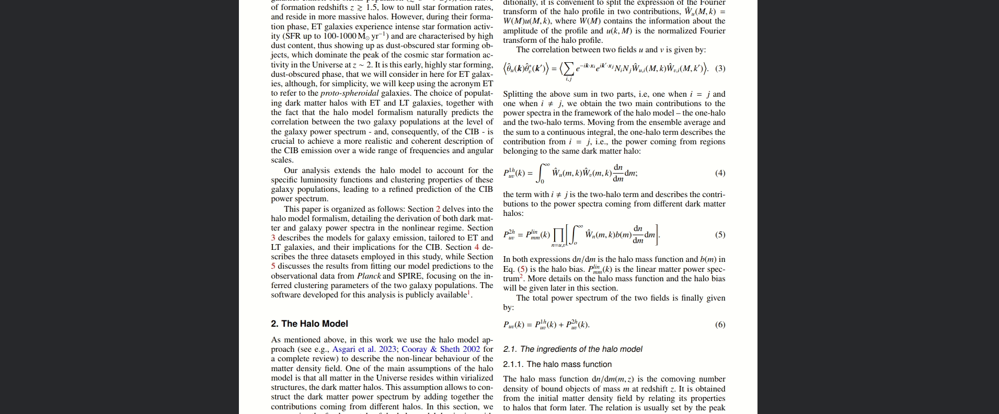

# joplin-pdfNotes
Bookmarklet for taking notes on pdfs and storing them in Joplin

## Demo




## Installation 
- Update the joplin token and port variable in file
```javascript 
var joplinToken = "";
var joplinPort = 41184;
```
- Inject script into page via a bookmarklet

